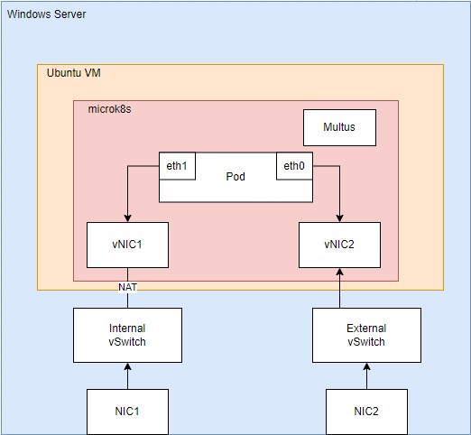

# Windows Server Setup

This repo explains the step-by-step to setup a working environment for the CV Project with Anicca Data.

The following diagram explains the architecture of the current solution:

There are three main steps to setup this environment

1. Meeting the requirements
2. Setting up the Windows Host
3. Setting up the Ubuntu VM and it's container runtime

## Requirements

**Base OS**: Windows Server 2022
**GPU**: Nvidia T4 installed
**Drivers**: [Nvidia T4 Drivers with CUDA Toolkit 11.6](https://www.nvidia.com/Download/driverResults.aspx/188600/en-us/)
**Enabled Features**: Hyper-V

In order to enable Hyper-V in the host, please run the following command in Powershell window with Administrator priviledges:
	
    Install-WindowsFeature -Name Hyper-V -IncludeManagementTools
Reboot the system.

Download required Image:

 - For Ubuntu Server (no GUI) use the following VHD:  [Link](https://aniccaautomation.blob.core.windows.net/vhd/UbuntuSrv.vhdx)
 - For Ubuntu Desktop (GUI) use the following VHD: [Link](https://aniccaautomation.blob.core.windows.net/vhd/UbuntuTemplate.vhdx)

## Setting up the Windows Host

Download the setup_ws.ps1 file from this repo.
Before executing the file, make sure to update the following lines:

This is the name of the VM to be created

    $VMName = "Ubuntu"

This is the path of the VHD file that was downloaded in the previous step:

    $vhdpath = "C:\VMs\Ubuntu.vhdx"

> **Note:** We recommend to create a folder in the C: drive called "VMs" and copy the downloaded VHD file into that location, renaming the file to match the name of the VM.

During the execution of the script, an alert will show asking for permission to unmount the GPU from the host.

The script creates an Internal Virtual Switch and configures a NAT rule to provide Internet access to the Ubuntu VM. 

After the script runs with no errors, a new VM will appear on the Hyper-V Manager.

## Advanced Configuration

By default, the Internal NAT Address Prefix used is 192.168.50.1 for the host and 192.168.50.2 for the VM. This subnet can be updated by modifying lines 23 and 24 of  the setup_ws.ps1 script:

    New-NetIPAddress -IPAddress 192.168.50.1 -PrefixLength 24 InterfaceAlias "vEthernet (NATSwitch)"
    New-NetNat -Name NAT -InternalIPInterfaceAddressPrefix 192.168.50.0/24
